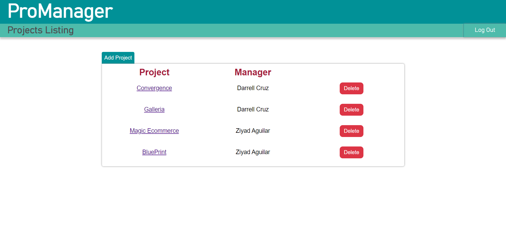
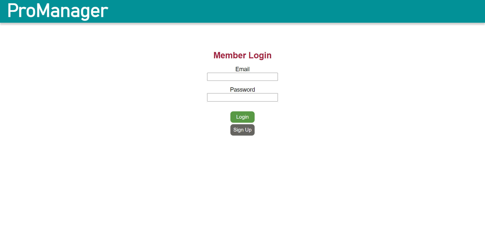
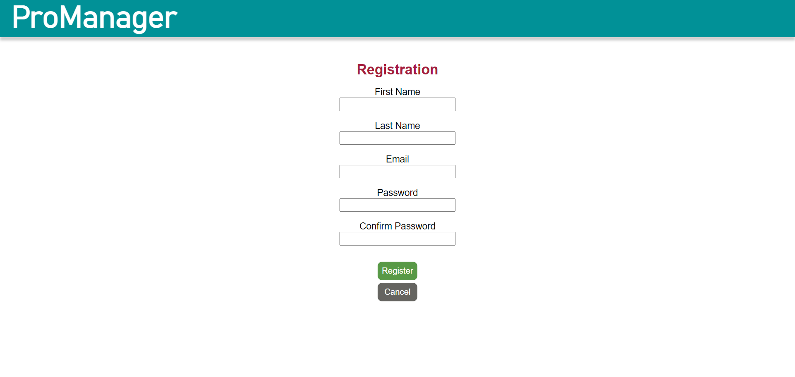

# ProManager

Application that allows users to create projects, add team members, create tasks and assign tasks 
amongst the team members.
The application allows editing of task assignments and projects

Technologies used: 
- SpringTool Suite
- Spring Boot framework / Java
- MySQL to access and manage the database

# Project creation function: 
### Project manager creates the project, adds team members from database of registered users

# Project information page with the option to edit, add and assign new tasks:

### Add, delete and edit tasks to fit the project's needs

# Login & Registration:
 
 
