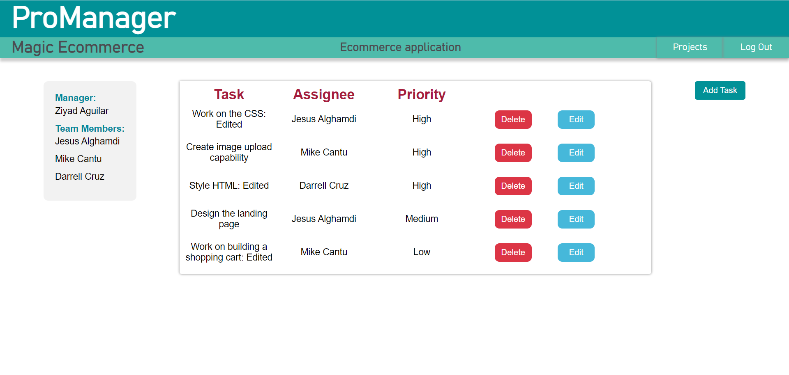

# ProManager

Application that allows users to create projects, add team members, create tasks and assign tasks 
amongst the team members.
The application allows editing of task assignments and projects

Technologies used: 
- SpringTool Suite
- Spring Boot framework / Java
- MySQL to access and manage the database

# Project creation function: 
### Project manager creates the project, adds team members from database of registered users, creates and assigns tasks amongst team members

# Projects listing and a project information page:
### List of projects 

### Project description, team members, project manager, and tasks with details and delete/edit options

# Task editing function:
### Tasks can be edited and deleted to fit the needs of the project

# Login & Registration:
 
 
