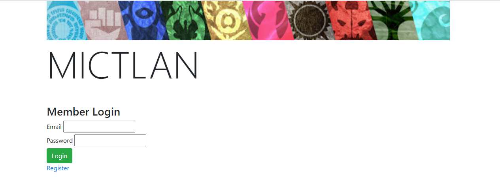
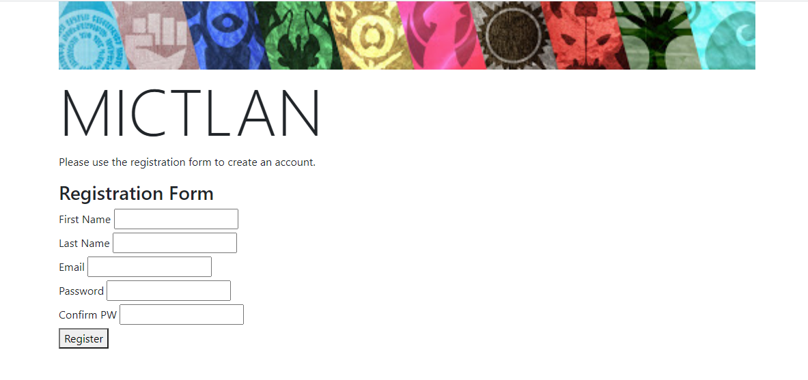
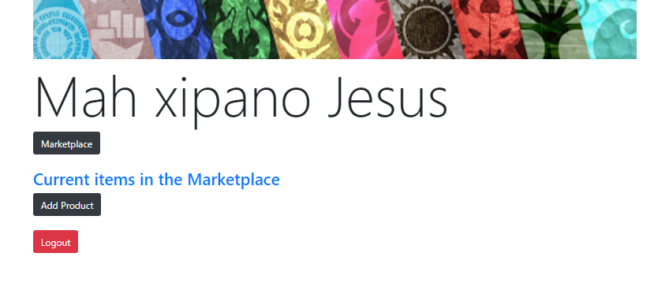
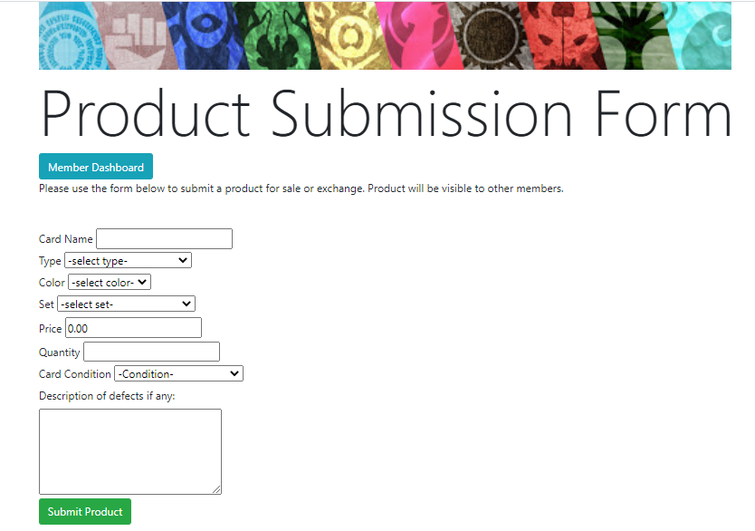
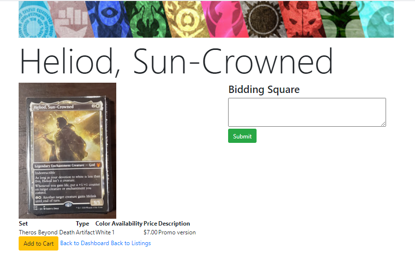
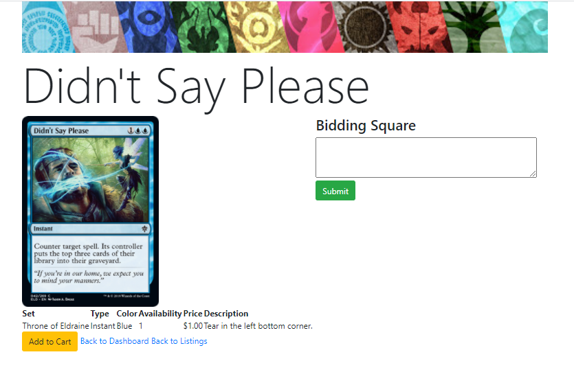
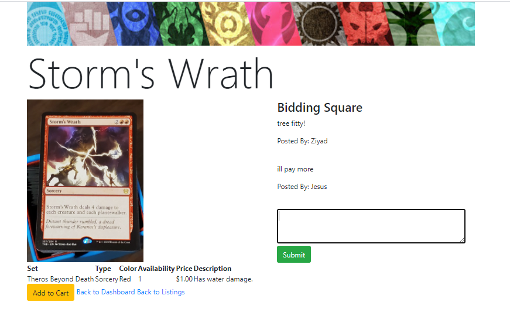
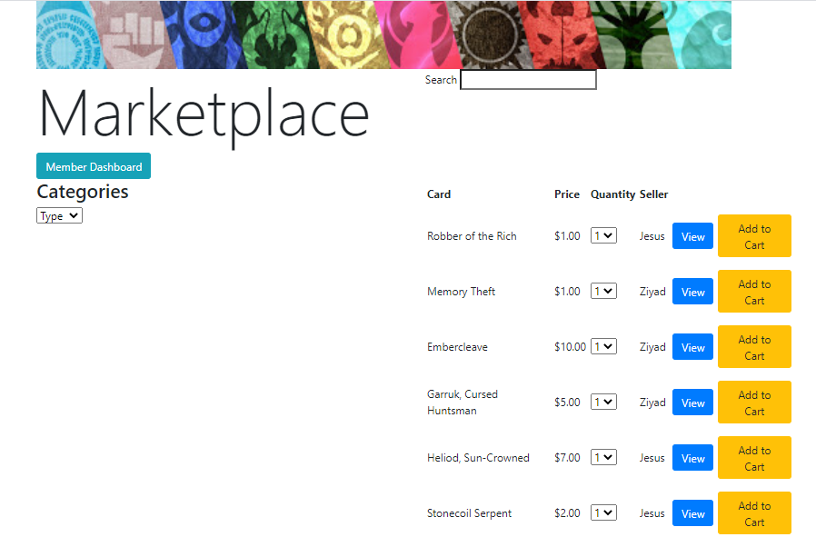

Mictlan is an Ecommerce application for Magic the Gathering cards with image upload functionality. 
- Built with Django framework.
- The application allows buying, selling and trade of Magic the Gathering Cards. 
 

Theme:
Mictlan is the underworld of Aztec mythology, a name fitting for a website dedicated to a game full 
of creatures - from vampires to zombies to dragons to necromancers, just to name a few. The Aztec also
had the most important market in Mexico, so the idea of an ecommerce application with a marketplace 
and bidding fit the overarching theme of the application. 

Below are images of some features of the application: 
- Account registration
- Product submission form that allows user to upload a product with an image and description
- Marketplace where registered users can browse through uploaded cards
- A bidding square unique to each posting where buyers/seller can interact

Integrated login/registration functionality

User Dashboard: Member has access to the marketplace where buying/selling takes place 
and has the option to create a product post. Dashboard will also list the products the member
has up for sale in the marketplace.

The seller can upload an image of the product, description of the condition and all the information
pertaining to the card. 

Each job posting has a "Bidding Square" where buyers can bid on a card if the seller allows it.

Marketplace:

