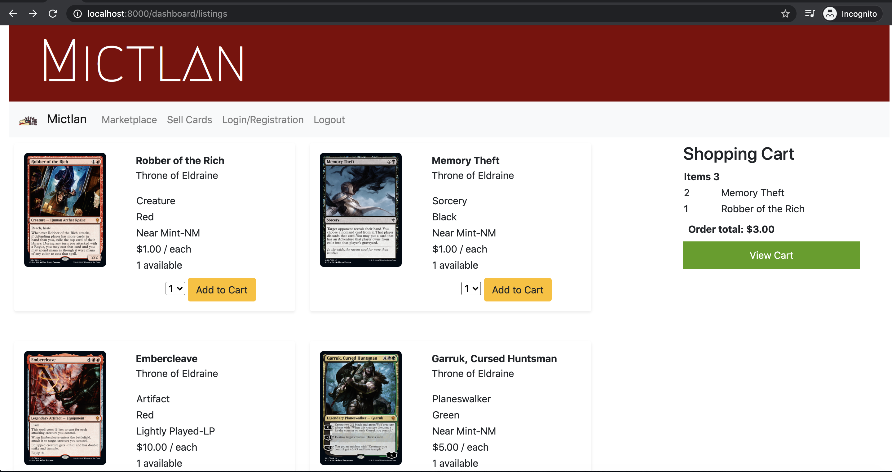
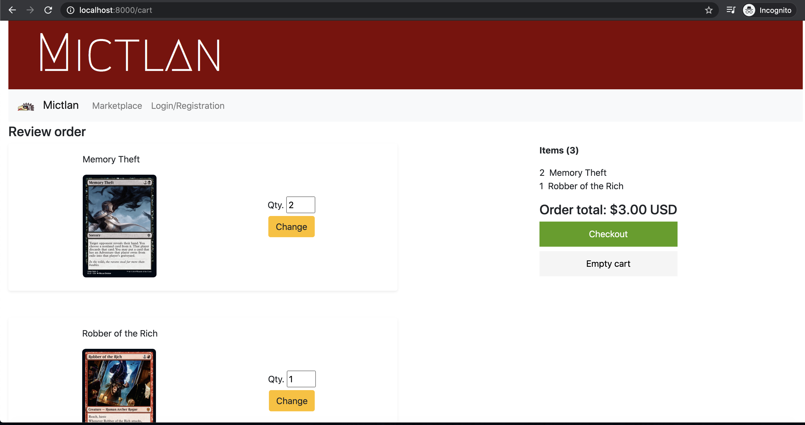
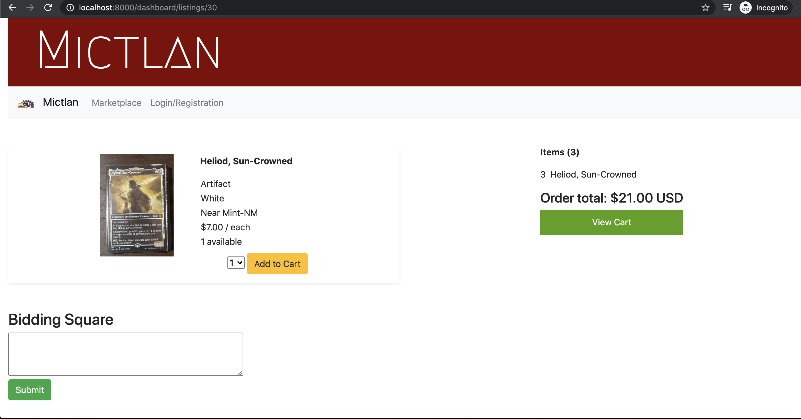
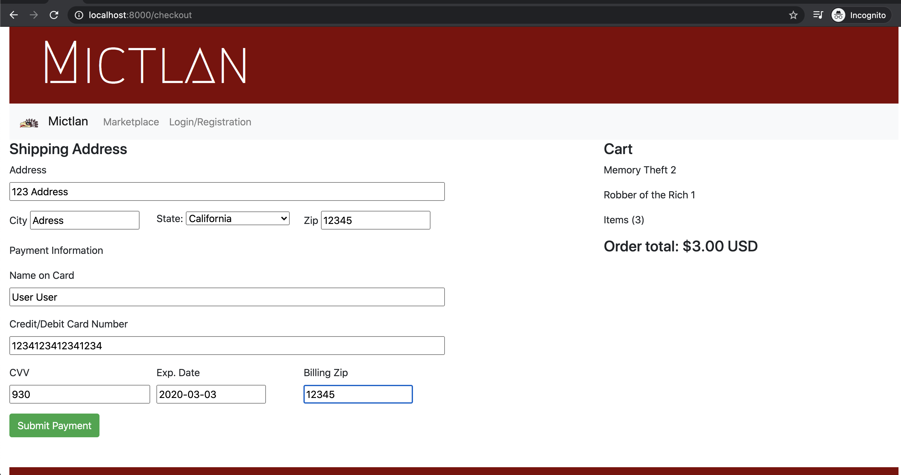
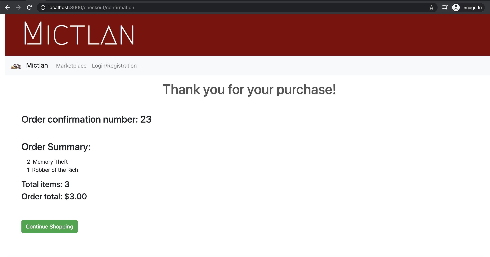
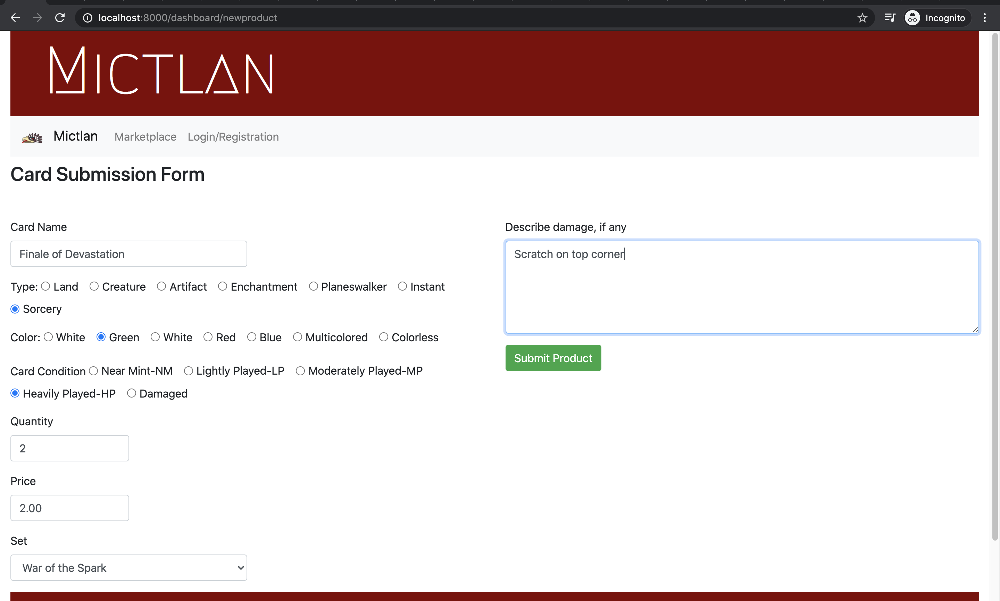
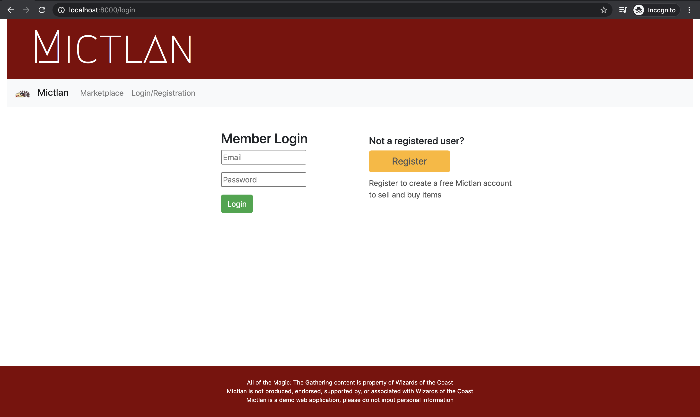
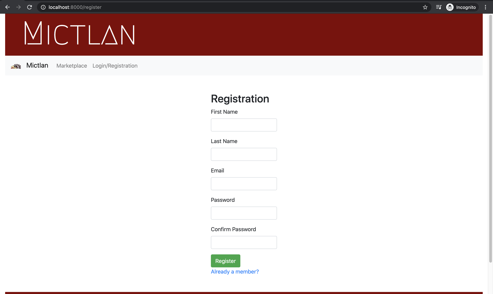

# Mictlan
Mictlan is an Ecommerce application for Magic the Gathering cards with image upload functionality. 
- Built with Django/Python framework.
- Implemented Boostrap for UI

## Theme:
Mictlan, underworld of Aztec mythology, a name fitting for a website dedicated to a game of creatures - 
from vampires to zombies to dragons to necromancers, just to name a few. 

**Functional features**: 

- Marketplace where users can browse through uploaded cards. Only registered users can buy/sell
- Login/Registration 
- Full shopping cart and checkout functionality 
- login/registration

**Main Page**

**Full Cart Functionality** 
Add to cart from list of cards

Review cart

Card view page

**Checkout and confirmation with order # (in this case it is the ID assigned in the database):**
Payment form

Confirmation page: Order number is the id from the database

**The seller can upload an image of the product, description of the condition and all the information pertaining to the card.**

**Integrated login/registration to allow buying/selling**

